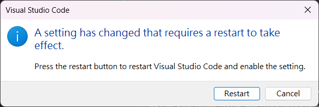

# Fluent UI Theme FAQ and Troubleshooting

[back to main README](/README.md)

## Table of contents

-   [Fluent UI Theme FAQ and Troubleshooting](#fluent-ui-theme-faq-and-troubleshooting)
    -   [Table of contents](#table-of-contents)
    -   [Universal](#universal)
    -   [Installation](#installation)
    -   [Uninstallation](#uninstallation)
    -   [Configuration Options](#configuration-options)
    -   [Need more help?](#need-more-help)

## Universal

1.  **Can I use this with other extensions?**

    Yes, you can use this theme with other extensions. However, some extensions may not be
    compatible with this theme.

    If you encounter any issues, please disable the theme and check if the problem persists. If it
    does, the issue is likely caused by the extension, please open an new issue on the github page.

## Installation

1.  **How do I install the extension?**

    Please check the [installation](/README.md#installation) section in the README.

2.  **Why does the corrupt installation warning appear?**

    This is normal, don't worry. This is expected behavior and is necessary for the extension to
    work.

    When you install the extension, extensions modify the workbench html file to apply the theme.
    Visual Studio Code sees the installation as corrupt because the file has been modified.

    If you want to get rid of this message, please follow the steps below:

    1. Click on the cog icon on the notification
    2. Select `Don't show again`
    3. You should be good to go

3.  **Why does corrupt setting has changed?**

    

    Don't worry — this is normal and expected behavior. It's a necessary part of how the extension
    functions.

    To ensure visual consistency and a smoother overall appearance, the extension modifies the
    `window.controlsStyle` setting to `custom`.

    Simply click the `Restart` button in the dialog to let VS Code automatically restart and apply
    the change.

4.  **Why does the extension not work after installation?**

    If the extension does not work after installation, it may be due to the following reasons:

    -   The extension is not enabled
    -   The extension is not installed
    -   The extension is not configured correctly

    To resolve this, follow the [installation](/README.md#installation) steps carefully and ensure
    that the extension is enabled and configured correctly.

## Uninstallation

1. **How do I uninstall the extension?**

    Please check the [uninstallation](/README.md#uninstallation) section in the README.

2. **Why can’t I use the default theme’s visual studio code normally after uninstalling it?**

    This is possible, but the chances are slim. If you encounter this issue, please follow the steps
    below to fix it.

    1. **Locate the Visual Studio Code installation directory**:

        - **For Windows**: The installation directory is usually located at
          `C:\Users\user\AppData\Local\Programs\Microsoft VS Code`.

        > [!NOTE] AppData folder not visible?
        >
        > AppData is a hidden folder, so you may need to enable hidden items in the File Explorer
        > settings.

    2. **Navigate to the workbench directory**:
        - Inside the installation directory, navigate to the
          `resources\app\out\vs\code\electron-sandbox\workbench` directory.
    3. **Check for Workbench files**:
        - Look for following files in the directory:
            - `workbench.html`
            - `workbench.bak.html`
    4. **If `workbench.bak.html` exists**:
        - Rename `workbench.bak.html` to `workbench.html` and overwrite the existing file.
    5. **If `workbench.bak.html` does not exist**:
        - Download the original `workbench.html` file from the official [repository] and replace the
          existing file.
            1. Open Visual Studio Code and find the version you are using.
                - Go to **Help > About** or run `code --version` in the terminal.
            2. Visit the official
               [Visual Studio Code GitHub repository](https://github.com/microsoft/vscode/).
            3. Switch to the branch matching your installed version (e.g., `release/1.95` for
               version 1.95).
            4. Navigate to: `src/vs/code/electron-sandbox/workbench`
            5. Download the `workbench.html` file and replace the existing one.
    6. **Restart Visual Studio Code**:
        - Once the changes are made, restart Visual Studio Code.
    7. The default theme should now be restored.

## Configuration Options

1. Unable to override the terminal, minimap, and scrollbar background colors.

    - I'm unable to override the terminal, minimap, and in some cases, the scrollbar background. So
      depending on the syntax theme you choose, the background colors will be off for those
      elements. You can set the colors for these panels (and others) manually via settings, like so:

    ```json
    "workbench.colorCustomizations": {
      "terminal.background": "#ffffff",
      "minimap.background": "#ffffff"
    }
    ```

## Need more help?

If you encounter any other issues or need further assistance, please check the github issues or open
a new issue for further assistance.

---

_Give your Visual Studio Code a modern, Fluent UI-inspired makeover today!_

_If you like this fluently themed extension, please consider giving it a ⭐!_

[Back to top](#fluent-ui-theme-faq-and-troubleshooting)
